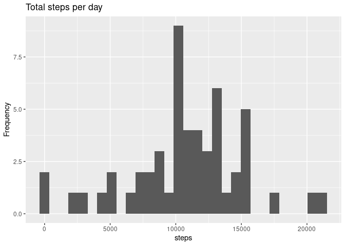
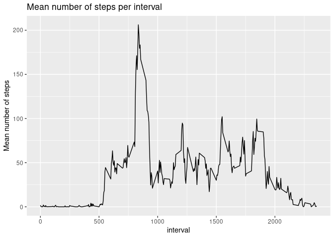
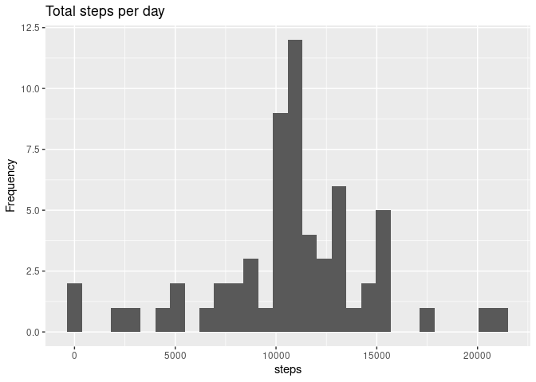
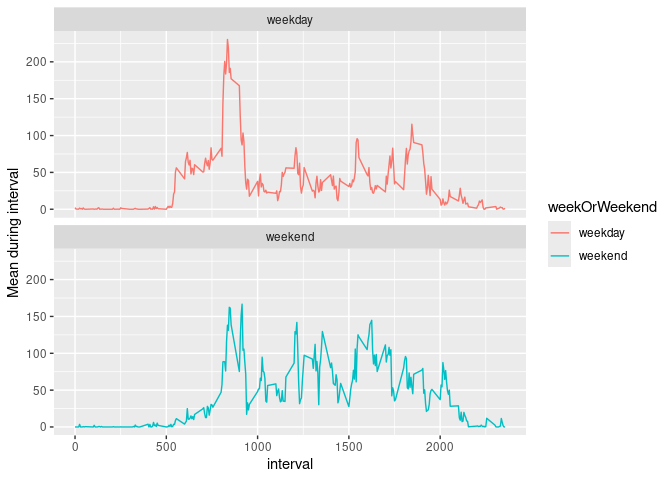

## Loading and preprocessing the data
Set global options:

``` r
knitr::opts_chunk$set(echo = TRUE, cache = TRUE)
```

Unzip the data:

``` r
unzip("activity.zip")
library(data.table)
data <- fread("activity.csv")
dim(data)
```

```
## [1] 17568     3
```


## What is mean total number of steps taken per day?

``` r
totalStepsPerDay <- data[, .(steps = sum(steps, na.rm = FALSE)), by=date]
head(totalStepsPerDay)
```

```
##          date steps
##        <IDat> <int>
## 1: 2012-10-01    NA
## 2: 2012-10-02   126
## 3: 2012-10-03 11352
## 4: 2012-10-04 12116
## 5: 2012-10-05 13294
## 6: 2012-10-06 15420
```


``` r
library(ggplot2)
# Basic histogram
ggplot(totalStepsPerDay, aes(x=steps)) + geom_histogram() + labs(title = "Total steps per day", y="Frequency")
```

```
## `stat_bin()` using `bins = 30`. Pick better value with `binwidth`.
```

```
## Warning: Removed 8 rows containing non-finite outside the scale range
## (`stat_bin()`).
```

<!-- -->


## What is the average daily activity pattern?
The mean and median (resp.) number of steps per day are given below:

``` r
mean(totalStepsPerDay$steps, na.rm = TRUE)
```

```
## [1] 10766.19
```

``` r
median(totalStepsPerDay$steps, na.rm = TRUE)
```

```
## [1] 10765
```
A time series plot of the mean number of steps per time interval is given below:

``` r
meanPerIntervalDT <- data[, .(mean_during_interval = mean(steps, na.rm = TRUE)), by=interval]
ggplot(meanPerIntervalDT, aes(x=interval, y=mean_during_interval)) + geom_line() + labs(title = "Mean number of steps per interval", y="Mean number of steps")
```

<!-- -->
Which interval has the maximum average number of steps?

``` r
index <- which.max(meanPerIntervalDT$mean_during_interval)
meanPerIntervalDT[index,]
```

```
##    interval mean_during_interval
##       <int>                <num>
## 1:      835             206.1698
```
## Imputing missing values
What is the number of missing values?

``` r
sum(is.na(data$steps))
```

```
## [1] 2304
```

Use previously calculated mean per interval to impute the missing values.

``` r
for(i in 1:length(data$steps)){
    if(is.na(data[i, steps])){
       interval <- data[i, interval] 
       intervalIndex <- which(meanPerIntervalDT$interval == interval) 
       data[i, "steps"] <- floor(meanPerIntervalDT$mean_during_interval[intervalIndex])
    }
}
```
Create a new data set with the imputed values included.

``` r
fwrite(data, "activity_NA_imputed.csv")
```
Repeat total number of steps:
## What is mean total number of steps taken per day?


``` r
totalStepsPerDay <- data[, .(steps = sum(steps, na.rm = FALSE)), by=date]
head(totalStepsPerDay)
```

```
##          date steps
##        <IDat> <int>
## 1: 2012-10-01 10641
## 2: 2012-10-02   126
## 3: 2012-10-03 11352
## 4: 2012-10-04 12116
## 5: 2012-10-05 13294
## 6: 2012-10-06 15420
```

Repeat mean and median


``` r
mean(totalStepsPerDay$steps, na.rm = TRUE)
```

```
## [1] 10749.77
```

``` r
median(totalStepsPerDay$steps, na.rm = TRUE)
```

```
## [1] 10641
```
We see that these values differ, but are actually quite close.
Repeat histogram

``` r
ggplot(totalStepsPerDay, aes(x=steps)) + geom_histogram() + labs(title = "Total steps per day", y="Frequency")
```

```
## `stat_bin()` using `bins = 30`. Pick better value with `binwidth`.
```

<!-- -->
We observe that the histogram is also very similar.
## Are there differences in activity patterns between weekdays and weekends?

``` r
library(dplyr)
```

```
## 
## Attaching package: 'dplyr'
```

```
## The following objects are masked from 'package:data.table':
## 
##     between, first, last
```

```
## The following objects are masked from 'package:stats':
## 
##     filter, lag
```

```
## The following objects are masked from 'package:base':
## 
##     intersect, setdiff, setequal, union
```

``` r
weekend <- c("Saturday", "Sunday")
data[, "Day" := weekdays(x=date)]
data <- data %>% mutate(weekOrWeekend=if_else(condition = Day %in% weekend, true= "weekend", false = "weekday"))
data[, weekOrWeekend := as.factor(weekOrWeekend)]
data[, mean_per_interval := .(mean(steps, na.rm = TRUE)), by=interval]
```

```
## Warning: Invalid .internal.selfref detected and fixed by taking a (shallow)
## copy of the data.table so that := can add this new column by reference. At an
## earlier point, this data.table has been copied by R (or was created manually
## using structure() or similar). Avoid names<- and attr<- which in R currently
## (and oddly) may copy the whole data.table. Use set* syntax instead to avoid
## copying: ?set, ?setnames and ?setattr. If this message doesn't help, please
## report your use case to the data.table issue tracker so the root cause can be
## fixed or this message improved.
```

``` r
meanDuringInterval <- data[, keyby=.(interval, weekOrWeekend),.(mean_during_interval = mean(steps, na.rm = TRUE))]
ggplot(meanDuringInterval, aes(x=interval, y=mean_during_interval, colour = weekOrWeekend)) + geom_line() + facet_wrap(~weekOrWeekend,ncol = 1, nrow = 2) + labs(y="Mean during interval")
```

<!-- -->

On weekdays the average number of steps seems to be higher.
